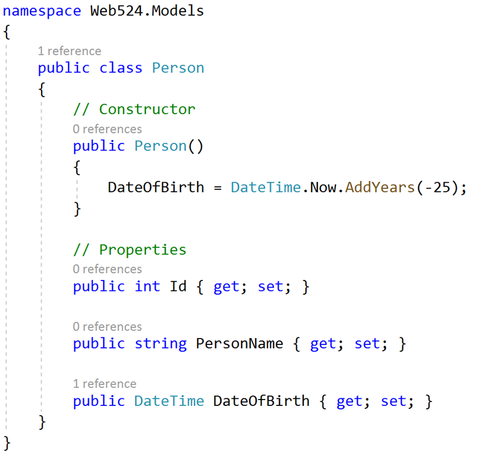
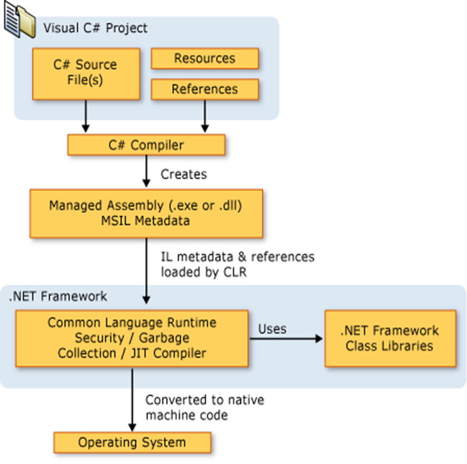
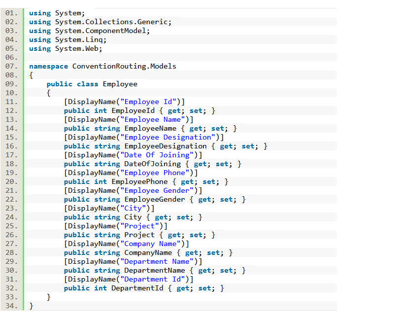

# Notes on a weekly basis

## A taste of C# and asp.net framework

C# is type safe and pure OOP language, and its curly brace syntax is similar to C, C++, and Java.

1. Any data type can be nullable. You can set int to null. E.G. Int?

2. Build in Linq(Language-Integrated Query). Search in memory or in DB. (don’t need orm? find out latter)

3. Validate form values with built in approach.

4. Generic methods and classes are allowed(Like template in C++)

5. Everything is inside one file, no .h .cpp

## Almost everything inside C# is inside class

The class is the most fundamental container or building block.

Code for a class is placed within a name space (Thinking about Java and its Package)

  Name space will help reduce conflicts from different developers. (Like in C++)

  Still you can use scope resolution

Try not to nest classes inside another class(unless it is only used inside that outer class.) (Like in C++)

Constructor is just like in C++ and Java, if you don't specify a consturctor, there will be default constructor provided.

Default is private inside a class.

Notice the way declare a default setter and getter is kinda like js/ts?


## Generics (like templates in C++)

Allowing generic classes and generic functions. (very cmmonly used in C#)( Will come back one day for adding more onto this part)

## Collections

This is like STL inside the C++. It provides all types of **containers** you could possibly come up.

## Interfaces

In C++, an abstract class with pure virtual methods. In C#, this is an interface. (You literally just declare a function header inside the class without {implementations})

An interface contains definitions for a group of related functionality that a class can implment.

In .net framework, the interface names start with an upper 'I'

Just like any coding languages, you can not instantiate an object from an abstract class or interface.

## IEnumerable and ICollection

IEnumerable: This interface provides a **forward-only cursor** of data. So the coders can **traverse** through a collection of items once a time without knowing the structure of the data.

A typical example, List from Collection is enmerable.

```c#
    IEnumerable<int> numbers = new List<int> { 1, 2, 3, 4, 5 };

    foreach (int num in numbers)
    {
        Console.WriteLine(num);
    }
```

ICollection: This interface represents a collection that **allows adding, removing and modifying** within the collection.At the same time. At the same time, this interface is inherited from the IEnumerable.

```c#
    ICollection<string> names = new List<string> { "Alice", "Bob", "Charlie" };

    names.Add("David");
    names.Remove("Alice");

    foreach (string name in names)
    {
        Console.WriteLine(name);
    }
```

## string in C sharp

String class is a **reference type** and **immutable** (just like Java it used string pool). However, with the efforts from the pioneers, it is behaving like a primitive type variables in the client code. Because you don't need new operator.

Every class has ToString() method.

```c#
// BTW you have to use double quote, this is not JS/TS
// And you have to use string not String (DO NOT CONFUSE WITH JAVA)
string myName = "John" 

// Here, it looks like nothing happened just a simple reassignment. 
// However, there is DMA happened behind the scene, which makes you feel like reassigning a integer variable. 
myName = "John Guan" 

```

A string could be null in C#, so you can directly compare. But empty, .Length == 0. There is a string.IsNullOrEmpty() function to handle checking both.

Never use single quote for string (like the JS/TS way). This can only be used for char.

String with upper S is the intermediate code syntax. String with lower is the C#.
  Never mix it up. 
  Never use String in C# codes.

string.format takes C style or F string style.

```c#
string br = Environment.NewLine;
string s = "WEB524 - Web Programming on Windows [Servers]";
Console.WriteLine(string.Format("{0}String length:   {1}characters", br, s.Length));
Console.WriteLine($"{br}String length:   {s.Length} characters");
```

## String To Number and Number To String

### From String to Number

1. safe way: use int.TryParse().

Return Result is a flag that indicates conversion success/not.

Moreover, this function is exception free.

```c#
    int foo;
    // out here allow function int.TryParse to manipulate variable foo//
    bool result = int.TryParse(“123”, out foo);

```

2. Unsafe use Convert.ToInt32().

This function could trigger exception if the process is not successful.

```c#
int bar = Convert.ToInt32("123");
```

### From Number to String

simply just call the ToString method, and even the number has the that method.

```c#
string foo = 123.ToString()
```

## .Net Framework



1. C# is not only launguage supported by .Net Framework

2. C# is compiled into intermediate language first (IL), and the extension is .exe or .dll.  (This is .net language file) (kinda sounds similar to java byte code, but this must be different from Java.)

3. Common Language Runtime (CLR) performs JIT (Just in time) compilation to convert intermediate language into machine instructions.

4. As long as the machine has .net framework, it can run the intermediate code file. (Again, sounds like JVM and Java Byte Code).

5. CLR provides Garbage collection, exception handling, and resource management.

6. As each line is compiling, the code is running. This makes the run time is slower than C++ and C.

7. Managed code(like C is unmanaged code), compiling and checking. Memory location is handled by the framework, which means no pointer to play around.

## ASP.Net MVC

1. ASP.Net is convention based ( which essentially means you won't see any thing like app.get("/url",callBackFunc) )
You will see something like this. (<https://www.c-sharpcorner.com/article/convention-routing-in-asp-net-mvc-5/>)



The .net framework will automatically hosts controllers.

2. Front Controller Pattern.

This is like middleware in node.js servers. Service runs before the controller instantiated.

Basically, this "middleware" will be invoked every time when there is a request.

Front Controller will look at the URL, the URL indicates what controllers and what services inside the controller should run. In this step, the controller might need data from the model. Then the processed data is passed into a view, and rendered by a view engine.

If there is no controllers found for this URL, it might be a image file or PDF file.

If it is not a file, then 404 will be returned.

## MVC MVC, what is it actually?

1. Controller (It is like a commando in the battle field)
    A class contains functions.
    Front controller inspects the URL, and decide which controller should be invoked.
    The functions will handle the requests when they come in.
    Each function/method will return a unique page.

2. Model
    A class, or an object contains different properties (public variables) on it.
    A model holds and manages the app's data.
    Data persisted in a storage is modelled by **design model classes**. ( Like node's mongoose schema )
    Data that is sent to the user or gathered from user is modelled by **view model classes**. (Sounds like a DTO to me, but DTO is only used in user's input)

3. View
    Basically, the HTML should generated from the controller.

    A view is a source code file that contains user interface code.

    A view is like the template describes the page should look like.

    In the template, you can pass the variables or a model into the template. So the html will be generated based on the value of that template.

    View are not directly accessible, you can not use browser to directly see the contents inside a view (but PHP can because it is file based.) ( think about can you use browser to render .hbs files?)

    Not all views render HTML, not all views require data from the controller.

    Just like node.js has handlebars, .net has Razor.
