# Design pattern and a taste of coding in C# and asp.net MVC

## 5 layers design and 3 layers design. 
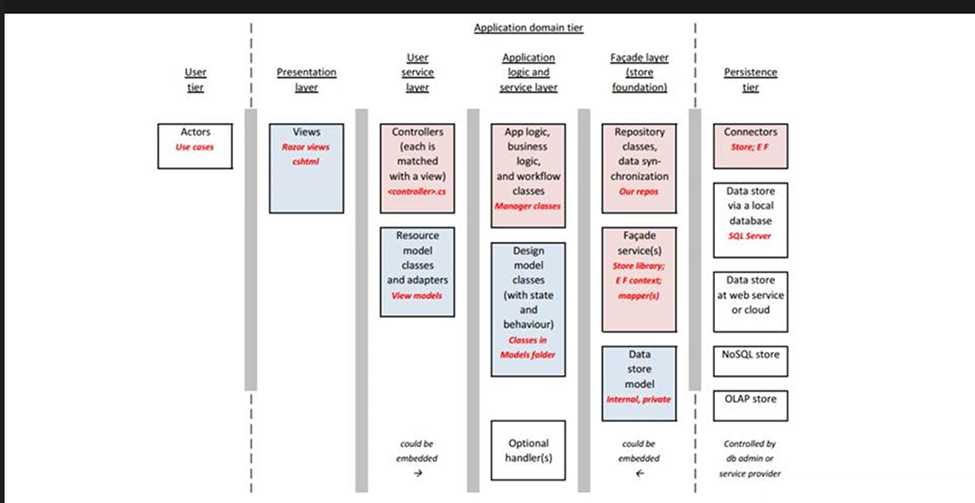

1. User uses browser to interact presentation layer from razor(views) Razors are those templates generates HTML.

2. Presentation layer (views) access Application logic and service layer
    Application logic and service layer has view model and controller.
        Controller is the brain of our operation, that’s where the logic goes into. 
        Each controller has functions inside, potentially one function should have a view respectively.
    Some views require data, but some don’t.
        If requires data, then you need view model.  
        Typically structured to make it easy to render a page.
        Or
        Make it easy to extract data from the request sent by the presentation layer.
        Two way DTO.

3. Application logic and service layer (Controller) does not directly talk to Persistence tier (DB) Instead, Application logic and service layer are directly interacting with Façade Layer ( manager class ) aka manager class.

4. Manager class:(Feel like the service layer in nest.js)
    Actual brain of the operation.

    Understand both models and convert design model  view model.

    Manager class is not allowed to talk to views directly. (You might expose your DB structure to users)

    Manager class used façade service as ORM to talk to DB.

    Manager class has a reference to the data context. It has methods that can be called by controllers. (getAllProducts)

    Design model (Entity Model): It is used to persist data into the DB, and receive data from the DB.  (Think about this as a schema in MongoDB, I like to build an interface before building a mongo Schema)

    Why we have this manager:
        A task defined in the Manager Can be used by any controllers.
        The manager promotes the use of a layered system architecture for safe and efficient coding.
        We never leak information or details about the data store.

## MS entity framework

A façade service called EF.
Working like ORM
MSEF has two major components.
    1. Data context: Stores tables meta data and configs.
    2. One or more: “design model classes” that describe the entities in the data store.
Place the classes in a folder called “Data” (This is from .net core)
EF maps a class to a table in the DB. Each property is a column in a table. (Think about other ORM, Same)
Relationships in a relational database are defined by properties called associations.

View model classes name convention and repo structure:
    You can group all the view models into a single folder.
    Or you should separate the view models into a single file.
    Use a composite name.
    
    Entity is the table name
    Since you have design model and view model, AutoMapper will help to convert one object into another object. 
 EF design model classes needs.

## Solution to converting Design Model <-> View Model => Auto Mapper

Why use this? So, you don’t have to manually convert from one to another every time.
Convention-based mapper =>
    When it maps between objects, it simply maps/assigns value if both objects property types and property names match.
    Non-matching? Ignored!
( More contents will be covered in the following week's notes )

## Code demo in class:

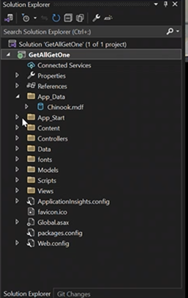
App_start contains setup and logics for front controller, and etc.
App_data contains our dev DB in local. Once build and run. It will start connect to APP_Data.
Contents: Front end assets.
Data: Design model classes.
Models: view models classes.
Scripts: JS files for front end.
Views: razor templates.

### Data -> DataContext

Data -> DataContext This is where you define the actual table with design model classes.

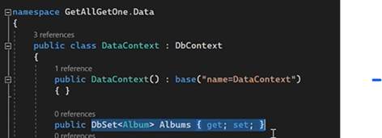

You inherit from DbContext Class.
You are declaring a new property called Albums. The Data type is DbSet Album.
Getter and setter are all default.

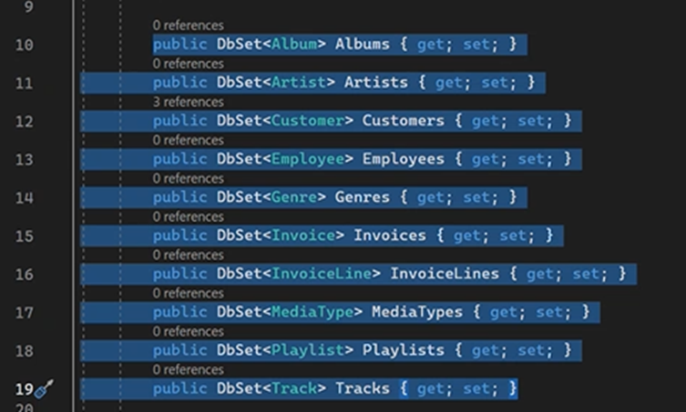

Each one of these DbSet Instance is a table.

### OnModelCreating(…)

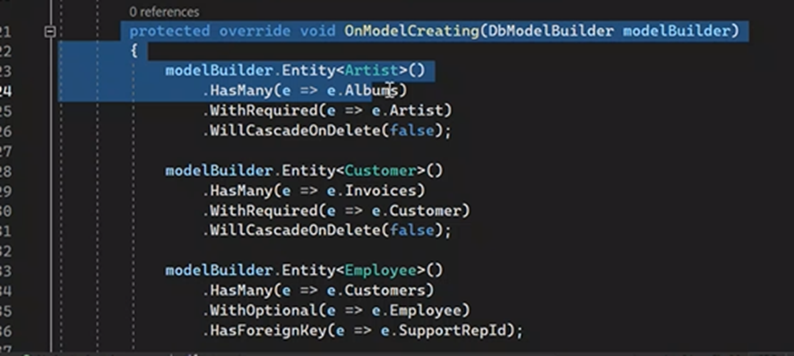
This is like lifecycle hooks in nest js?
But here we define the relationships between tables, define the constraints of the table.

### A sample of design model

Move onto the design model -> customer.cs

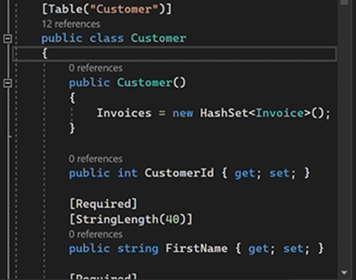

\[Required\] is like decorators in nest.js or java. Setting constraints for the column.

Also DB data type needs to match the designModel class datatype.

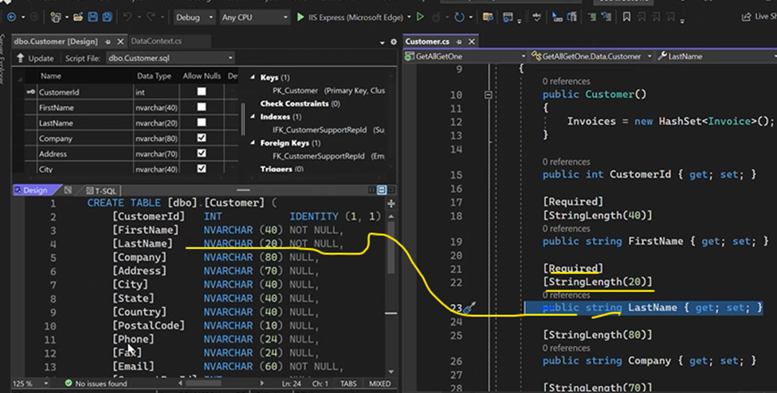

Also, put a question mark beside the return type. This means it could return a null value back. So, there won’t be any dummy values.
It makes sense that the require annotator is not put above because the

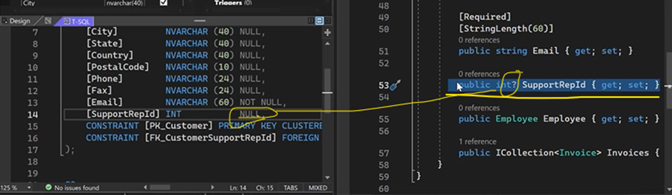

### Inside the controller

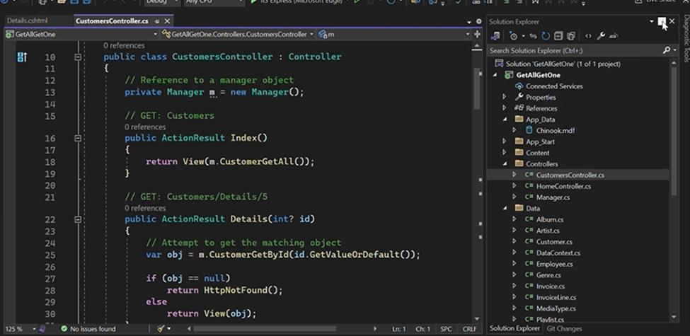
Everything starts with controller.
Request comes in, Index function runs.  (how Index() found out?)
View(dataPassedIntoHere)
View will generate the HTML out.

### AutoMapper

Can easily convert design model class object into a view-model class object.
Then return to the front end.
Never send the design model class object to the controller.
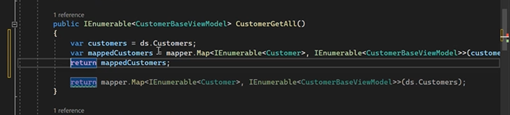
Also, you could have more statements after the Model.
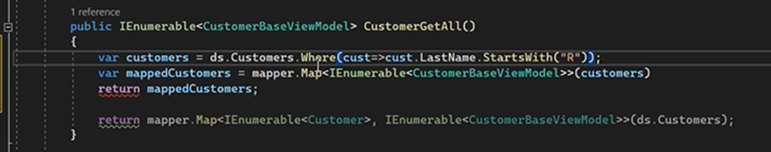
