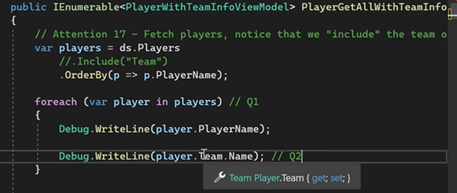

# Associated Data and implementation in .Net MVC

## Relationships between entities

Real production environment, entities are not standalones entities from the previous.

As a result, the software objects can have associations between them.

In dot net mvc, you need to prepare from design model -> facade layer -> controller -> view model

e.g.1 One to many

Some examples of one to many

e.g.2 Many to many

Many teachers can teach many courses.

Many students can take many courses.

## Preparing the design class - TO ONE

1.Declaring a Navigation Property:

This is like the PK of the parent table must be the FK in the child table.

*Navigation properties must exist in both tables.*

So, one record from a table can be navigated to another.

(failed to do so will make EF confuse what relationship it is between these two tables)

2.Declaring a “To-one” Navigation Property

  Product table has a field like this:
  
  

  This product is sold by only one supplier. Inside the product class.

  1.[Required] must be there for the integrity.

  2.Property Name follow the Associated Class Name.

3.Setting the value of a "to-one" nav-property

Before assigning, there might be some linq operations to find it. And if you cannot find it, there should be exceptions or something else.

In the example, just hard coded it.

## Preparing the design class - TO MANY

1.Declaring a “To-many” Navigation Property:

BTW you need to initialize the Products in the constructor.

(because of the interface cannot be instantiated)

Usually HashSet <TEntity> or List<TViewModel>

This is the Supplier Class:

Why in design model you have to use ICollection?

For the performance reasons, EF needs the ability to add and remove items to that collection.

IEnumerable does not have the ability to do so. It is only iterable.  

Think ICollection 666 and IEnumerable 444.

2.Setting the value of a “to-many” nav property:

Hint: There are actions before assigning => find what products add to the Products collection.

Or you could even replace the whole collection like the second line of the code.

Summary:

You must add the navigation properties onto the *both side* of the relationship entities, otherwise the EF will get confused.

And you must use the different types of navigation properties like Single Object or ICollection to specify the relationships between each others.

No you don’t need to, EF is so smart that you only need to set up once on either side of the class. The moment you call save changes, and the EF will handle the rest of the work for you.

Jumping tables:

Just use dot operators can achieve it if you need.

## Preparing the view models

Before we start, we only need to add navigation property onto one side of the view models (which side needs add it)

But do remember, *design model* needs to add twice.

Example of setting up view model associated data:

1.First setting up TeamBaseViewModel class:

2.Setting up PlayerBaseViewModel:

3.Setting up navigation properties for the PlayerCollection:

Why base model?

Because of the associated data. When we want to introduce an association, we create a new view model, that is called “With Model”.

A.Inherited from the baseview model

B.Name the ClassName by using WithAssociatedClassName

C.Navigation field use the container type is the IEnumerable<T>

D.Initailize it inside the constructor

Warning =>

View models should never link to the design model class.

So it must be inherited from the <PlayerBaseViewModel>Players.

not<Players> this will expose your design model.

not<PlayerWithTeamViewModel> this will cause stack overflown.

Chicken egg problem.

4.Adding the Navigation property for the team object:

A. The name of the view model class, it inherits from the “based” view model.

B. Navigation property data type is a view model class type

C. The Name ( navigation property) exactly matches the name in the design model.

D. The to-one navigation property almost needs a required data annotation.

## AutoMapper and associated data

Overall, automapper works smarter than you expect.

example:

1. Scenario: Including an associated collection:

1.Create view model setting up navigation property only on one side.

2.Set up mapper configuration inside the manager class.

3.Use include while using linq.

4.Send back the data from the controller.

Manager:

Find only works on the standalone entity. Not on the associated property.

Include meaning auto populate the Player field by inner join ( automatically join table for us)

2. Scenario: Mapping an associated object

3. Mapping some individual properties of a related object.

You don’t need all the fields from the associated class. Automapper can do the cherry picking for you.

*Name Does matter for AutoMapper*

Auto mapper knows how to find those fields from the Team class.

But if you name it differently, GG. Not working. This is why we always name it like the associated Class.

## Scaffolding - Displaying associated data in a view

Sad, scaffolding won't work from the associated data, which means you have to manually do it.

Scaffolder will ignore the associated data and the navigation fields you created.

A. For a collection of associated data:

This is like react or Handlebar.

B. Displaying a single object of associated data

Use dot operator to reach the field you would like to display.

C. If it is named with the field

## Include technique

1. Use include method on DbSet<TEntity>

You can only apply directly to

  Ds.entityName.Include

You cannot apply to

  DS.entityName.find().Include()

When you used *include*, you cannot use find, so only use singleOrDefault()

2. You can include multiple time; this is like join multiple times.

3. Chain pattern:

Going deeper into a relationship. This is like Tracks -> Album -> Artist.

Use dot notation inside the bracket will help.

4. Suggested query strategies:

You might not want to include() for the getAll(), because of the amount of the work and data size.

Think about getAll() use case, people won’t really care very much about the detailed data for each.

They start caring in the getOne(), so we should use include() method inside the getOne().

## Lazy loading vs Eager loading:

*Deferred execution* -> we can keep building the query until we want them to be executed by using certain methods or reaching some properties.

Query was not triggered at line 97, it was triggered when the coders used ToArray() method.

To list() also works. Using a range based for loop. Also the Automapper kicks in.

*Eager loading* ->

1. Occurs every time we add the include keyword to that query.

2. We have an association.

We want to Populate the associated data right after the query is triggered. Every time, you have include ().

Since you used “include”, the eager loading will be used once the query is executed.  

Once it reached foreach, query will be executed as one, and associated data Team will be populated.

*Lazy loading* ->

1.	No include() inside the query

2.	A query includes associated data.

3.	The query will not immediately fetch the associated data.

4.	Instead, it will wait for an attempt to access the associated object or collections.
(This is used for the apps like tinder)

This time you did not use include. Query was executed at for each.

But you tried to access Team, however you never include the team.

EF is smart and lazy loading will be in the game, every player will cause a query as matter of fact.

In MS EF, the Lazy loading by default is on!!! But the performance will be bad.

Don’t mix deferred execution.

Deferred execution is about writing an query and it won’t be executed right away. It will be executed only when needed in some operations.
