# DB creation and EF in dot net MVC

How to create a project from the scratch:

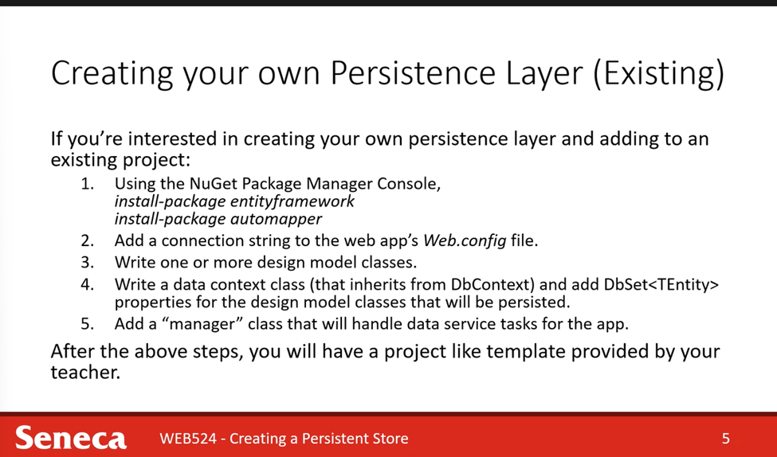

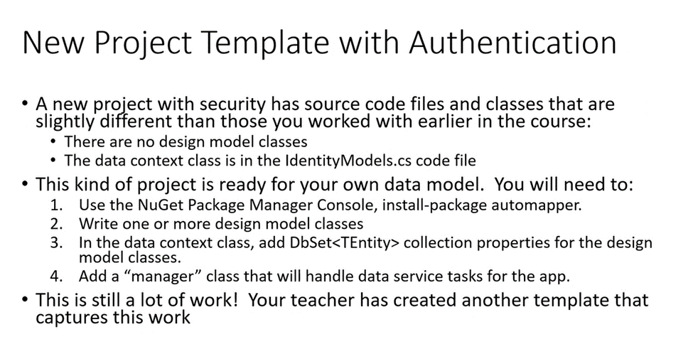

## Design Model Class Conventions

Remembers the rules and conventions when writing design model classes. They ensure that the database is initialized and configured correctly, and it will improve the quality of other coding tasks as you build the app. 
1. Add the design model classes into the data folder. 
2. Name the unique identifier property Id and use int data type.
But why not Entity + ID? Because the this will make automapper easier to map and the view model can just copy id so the scaffolder can be very happy about the ID so the Ids won’t be mapped out. 
3. Validation data annotations are limited to \[Required\] and \[StringLength(n)\]
Ints double, dates do not need this Required tag. You will be able to use question mark in the controller to handle this.
4. When defining an association between two classes, navigation properties must be configured in both classes.
Required “To-one” navigation properties must include \[Required\] attributes.
“To many” Navigation properties must be of type ICollection\<T>, initialized as HashSet\<T>
5. Initialize DateTime properties and default data in the no-arg constructor. (Otherwise you will get some funny dates)

## Database creation

When does the database get created by the database engine?

DB is not created because you created the project.  It is somehow ad-hoc. Because it was actually created when you use the database.

The DB was created via a mechanism called DB initializer. The DB initializer will check if the DB exists, if not it will start creating a DB.

## Adding new objects to the persistent store

After defining a data store, we can programmatically add new objects.

It is convention-based strategy that uses A Seed () method to populate the data store with new objects. (it is used in the real world, but the data must be static)

Manager Load is a bit simpler to understand and is compatible with a future “bulk data load” topic. ( this is more flexible and the data can be loaded from the other sources dynamically)

Manager load strategy: Inside the manager class, it has a load data.

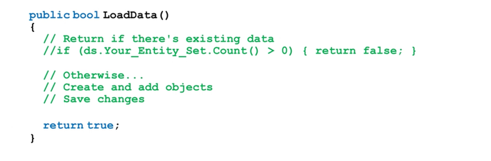

But you need to invoke the method, where to invoke? Inside the throw away controller 

Make sure you protect the controller well. Call the throw away controller (I used curl before to invoke the population controller route).Then, keep or deleted depends on the use case.

Done, the data storage is populated. 

## Making changes to the design of the persistent store

After running the program for a few months, your DB schema needs to change. How to migrate the DB schema?

DB schema adjustment can be done if the activate a feature called Code First Migration. This migration will save most existing data after migration.

It is like working with Github:

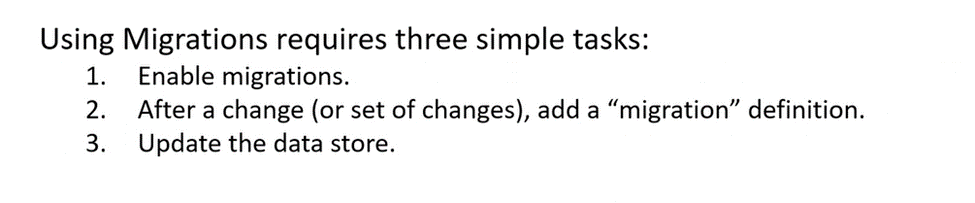
    Init

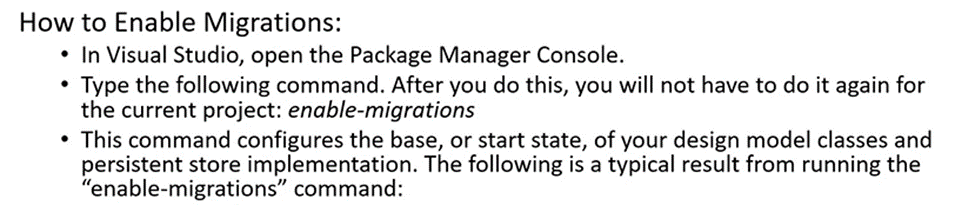
    Add changes.

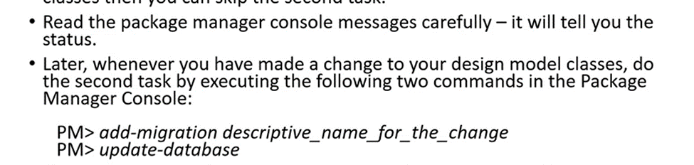
    Update database.

## Migration Failed? Revert it

1.	Be aware that the Migrations folder in the file tree will be created when the changes are made.

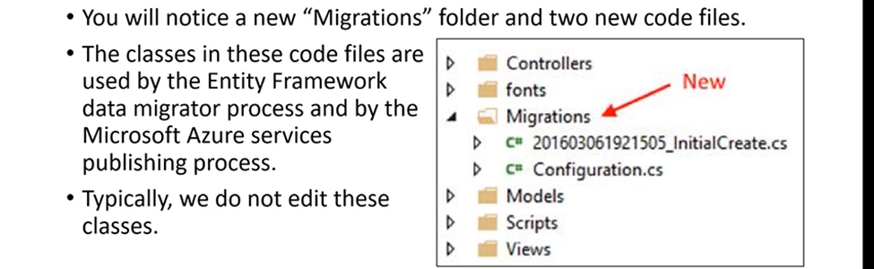

2. Easy fix:

Delete migration folder and try the process again might help. 

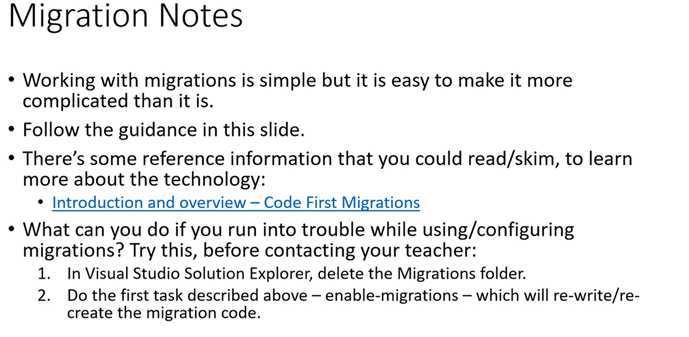

If the issue is from design model, then of course this will not fix anything. 

## Major design model change types:
There are basically two types of changes=> widening and narrowing
Widening:
    Widening=> Adding data to the DB 
        e.g. : Adding a new table, new column, change vachar (100) -> Varchar(150)
    Changes to an existing property’s configuration will work correctly for transformations and conversions that are implicit. 
    These widening transformations will work without any additional code or data preparation.  
Narrowing:
    Narrowing => you are removing a column, table, or adding more constraints on the DB. 
    Example: If you plan to add a \[StringLength(200)] attribute to a string column, but there could be cells containing more than 200 chars.
    This could potentially cause loss of data or precision, then you must inspect and prepare data before and after the property configuration change.
    Migration tool will warn you but not stop you, so you have to read carefully. 
    Widening is easier than narrowing. Rather than narrowing or widening, we should be more strategically reacting to any potential loss. 

## Alternative strategy to preserve data

An alternative strategy, which works for existing in production apps, would involve several tasks:

1.	Add a new property, which will hold destination value.

2.	As a special task, go through all objects in the entity set, and use data from the existing property to populate the desired value in the new property. 

3.	If you want to start using the new property in your manager and controller code, go ahead.

4.	Alternatively, you could delete the old property and add it back again with the desired data type, go through all the objects in the entity set to copy form the property added in step 1 above, to just added again property, and finally, delete the property added in step 1 above.

## More suggestions from the practitioners

One solution could have many project files inside.

Real world in-production apps tend to separate the persistence layer from the application.

In the technique, we create a “class library” project: Defines and hosts the design model classes and data context.

This action creates a persistence layer, and a whole bunch of apps from this solution file can use it.

In the web app project, we “add a reference” to the persistence layer, so that our manager class can work with the data.

When we need changes to the database, then we can use traditional database administration tools to perform the modification or migration.

If not using migrations, we modify the code in the persistence layer project to match the new reality in the persistence layer.

## Walk through demo

Don’t run your program yet because your DB will be initialized.

But make sure you build it.  

MS creates data context into the model, so now you need to go the model dir then move it to data.

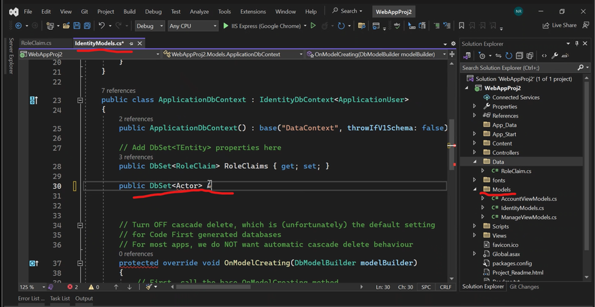

When loading data, make sure the DB is empty. This makes sure the data is not loaded multiple times.

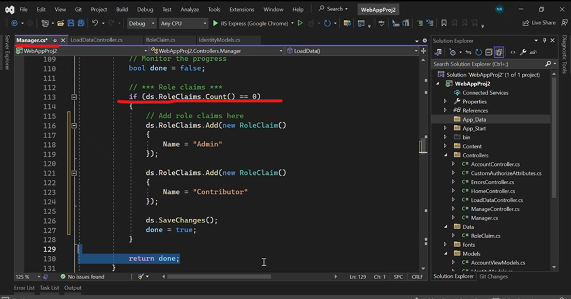

### Before migration

If you added a property in the design model without migration, GG.  Compiler will tell you it is out of the sync.

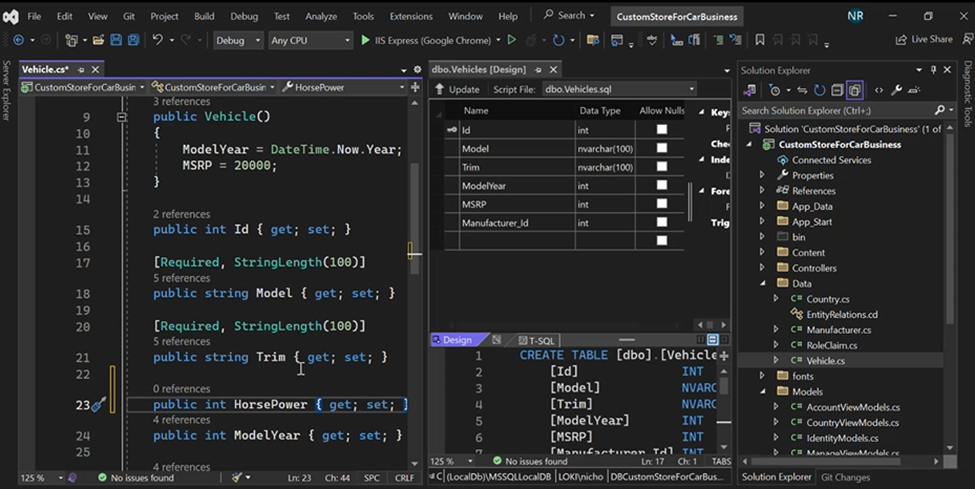

### Step 1

This step only added migration folder, looked at the difference between DB schema and Data -> Model.cs

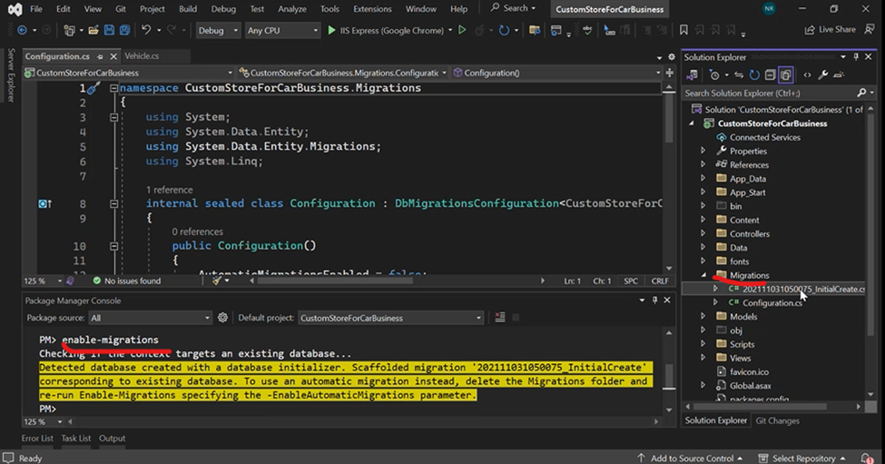

Notice the app_data -> db has NOTTTT been updated with the new field.

### Step 2: Stage your work

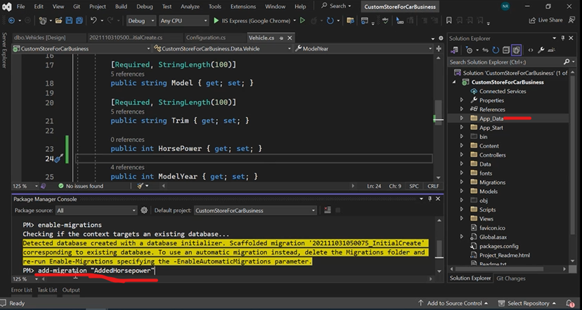

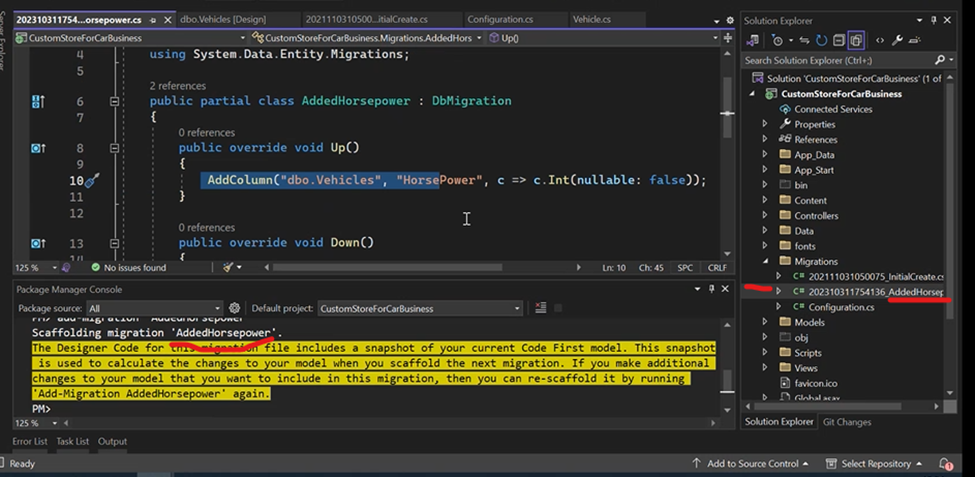

Inside the migration -> staged work -> The code is trying to add the new column into the DB. But it has not been run yet.

Notice the appdata -> db still has NOTTTT been updated with the new field.

### Step 3

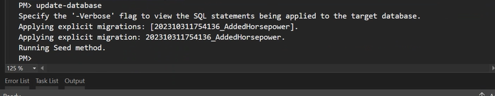

Nice now it is updated:

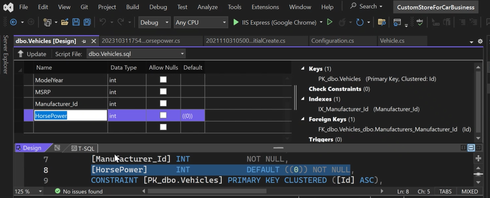

Migration is powerful but it has problems at the same time because you are not paying attention and then loss data.