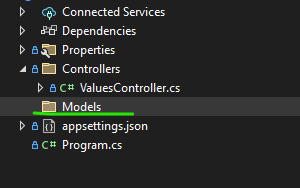
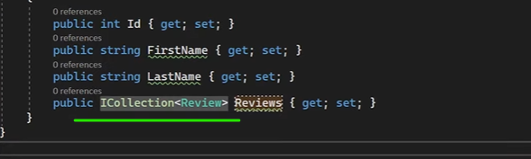
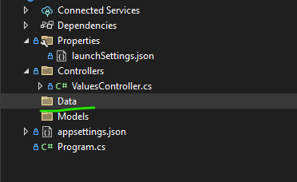
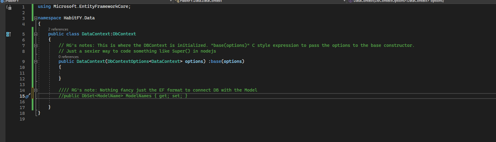

# Intro of dot net core API

## Program.cs (like your exprss's index.js where the app gets config and wire up)

```csharp
var builder = WebApplication.CreateBuilder(args);

// RG's note: You are configring here whenever you add a new packages.
// Add services to the container.
//__________________________________
builder.Services.AddControllers();
// Learn more about configuring Swagger/OpenAPI at https://aka.ms/aspnetcore/swashbuckle
builder.Services.AddEndpointsApiExplorer();
builder.Services.AddSwaggerGen();
//__________________________________
var app = builder.Build();


// RG's note: This is where you plug in the mid ware. (reminds you the good time with app.use?)
// Configure the HTTP request pipeline.
if (app.Environment.IsDevelopment())
{
    app.UseSwagger();
    app.UseSwaggerUI();
}

app.UseHttpsRedirection();

app.UseAuthorization();

app.MapControllers();

app.Run();

```

## Models ( where the dot net frameworks store the model classes)

Unlike you are making a MVC or Core application, service does not need 



Those rules from MVC like design models use ICollection interface for handling one to many or many to many still works.



## Using EF core in dot net core

### Initial set up and DataContext

It is 90% same to the EF core.

You will need a folder called Data



Inside the data context will be point where you connect models with the DB tables.



Final step, do not forget to add the ef core into the program.cs file (Any package must be registered in the program.cs)

## Attempting to connect to a DB

AppSetting.json will be related.

## Dot net attempt to connect to identity
