# ORM IN C# and Data Annotations

## Data Annotations

Think about it as the decorators but they are for the properties in a class. (like python’s decorator)

1. Where to put -> above the property declaration.

2. Why we have this? -> Essentially, we will save the amount of code that must be written to handle data mgmt. scenarios.
    Set constraints and limits for the property.

    Input data validation from the frontend. (save so much codes on both ends) Property display and formatting in views.

    Display error messages for the users.

But we can not replace the validation regarding the business logic of course.

You can have one or more data annotation for a single property.

There are data annotations for design models and view models separately. We should not mix these two types of.

Lib path #include System.ComponentModel.DataAnnotations

Data annotations will restrict the values goes inside the form. But it won’t cover all the special cases based on your business logics. So validation logic is still needed, and you should never rely on the data annotations.

## Data Annotations - Design Model Classes

### [Required]

This will add not null constraint onto the DB table.

Can use for data and for relations.

Int or Double should NOT use this because they always have a non-null value (unless you have int?)

This is only for string and object.

### [StringLength(n)]

IF n is not specified, it will be varchar (max). So this will set the max size of the string.

### [Key]

This is setting the property as the PK on that table inside DB.

Recap, the other two ways are name the property as id or tableNameId.

### Of course there are more, but the most common ones are listed as above

## Data Annotations - View Models Validations

This is used while frontend is taking information from the users.

### [Required]

The property cannot be null. User cannot skip this field in the form.

### [StringLength(n)] or [StringLength(n,MinimumLength = m)]

Specify the maximum and minimum length of a string.

### [Range(min,max)]

Ensure a numeric data type is between these two values.

### [Compare(“PropertyName”)]

This is used while registering new customers accounts, when they key in passwords twice, this can check the both times matched.

### [ RegularExpression(“regex”)]

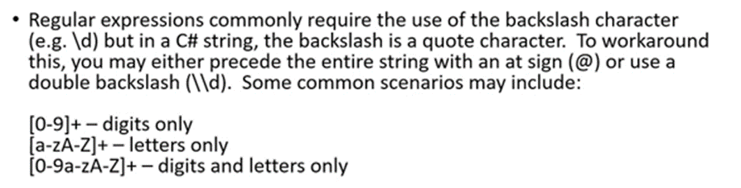

C# regex is quite different from the js regex.

Also you could customize the error messages. THe view model validations will provide default error messages.

You could customize it right in the data annotations.

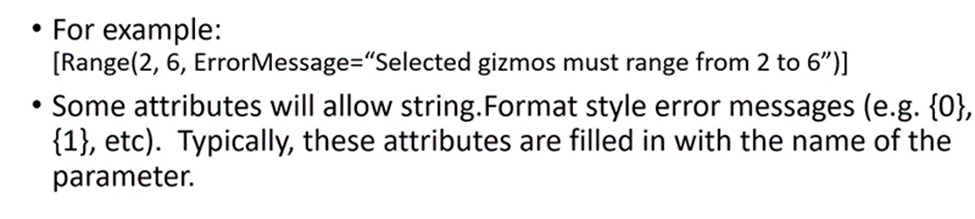

## Data annotations View Model Scaffolding

This is used when .net framework codes when you click the create view inside the controller.

### [key]

Use this if the PK is named other than “id” or “tableNameId”

### [Display(Name = “Better Looking Property Display Name In Rendered HTML”]

Change the text that describes a property.

Default is the property name. 

### [DataType(DataType.Password)]

Other options can be EmailAddress, URL, Currency, Date, Time, and More. 

### [HiddenInput]

The rendered as Input type = hidden /

It is often used for an object’s identifier that will not be shown to the user. 

### [ReadOnly(true)]

As the name suggested. Like the const in js

### [Editable(false)]

Not rendered in the browser.

### [ScaffoldColumn(false)]

This will prevent the whole column being scaffolded.

## LinQ

### Intro

LINQ even works on data collections which are located in memory and tables.

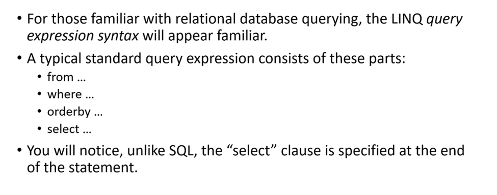

An example query. Always where goes before order by.

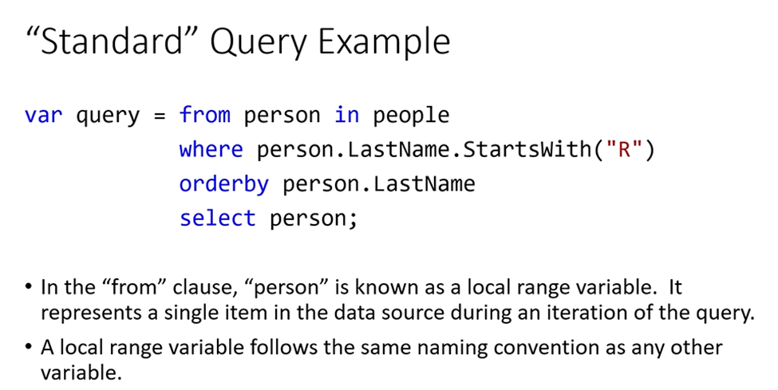

People can be array or table.  You can use projection in like select person.LastName

Never ever forget to use select “localRangeVariableName”; to end the query.

### Fluent query syntax

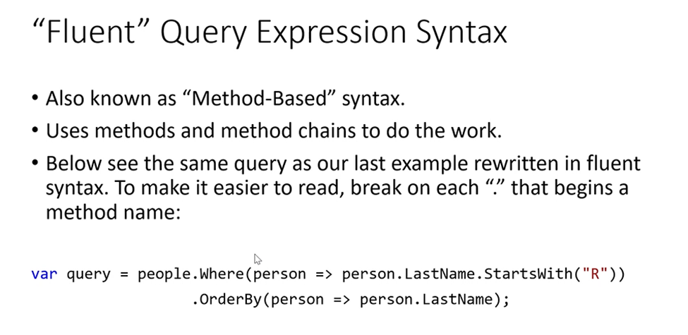

This is like a lambda in JS.

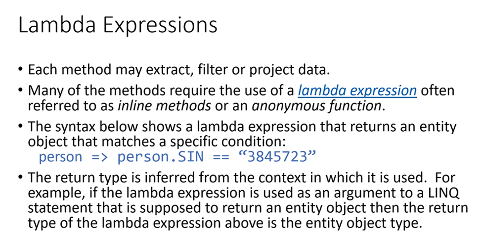

How to understand the query.

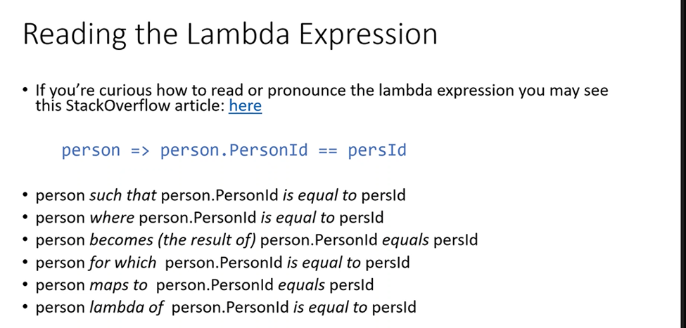

More code examples on Linq:

getAll?

The standard method: Where should always goes before the sorting. 

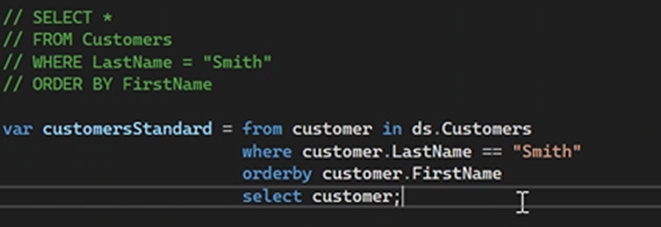

The fluent chaining methods:

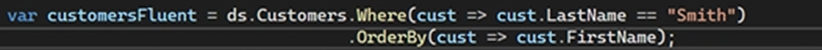

### "triggers" (key words which consists a linq query)

Find:

Precondition:

  a. Find can only work with *DbSet*

  b. You are working with the *PK* to find the object.

(So you cannot use Find on Arrays) (you cannot use non-pk as the filter)

Advantages:

Find has temp memory space -> your second time query will not run into the DB, it will go to the temp memory. (cache).

So it is faster than SingleOrDefault() and saves resource if this query will be executed frequently.

Example:

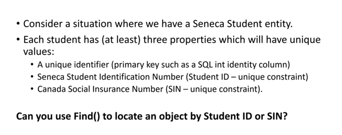

No, why? Cuz Student neither those two are PK!! Because they are not PK.  They are only unique.  

SingleOrDefault()

Precondition: Unlike find, it takes a lambda expression. More precisely, a predicate.

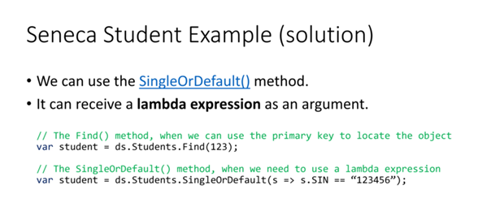

More "trigger" words:

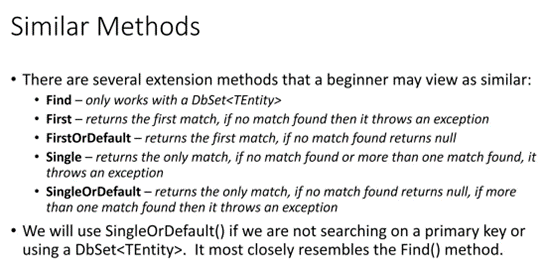

SingleOrDefault, FirstOrDefault, Find they will return null.

Notice *Single*, *First* they will throw exceptions if there is no found record. But why would you want to have something could potentially throw exceptions?

Because it is faster, and you can guarantee that the record is there.

### filter and sorting

( Sorting and filtering are normally done inside teh manager class. )

1.Filtering (where):

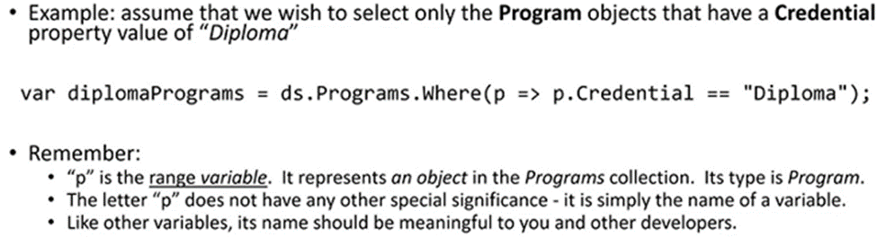

P is the range variable (like an iterator)

2.Sorting (OrderBy and ThenBy):

Default sequence is ascending like all coding languages.

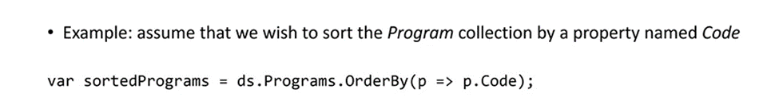

OrderBy can be used on any object of type IQueryable<> and it will return an IOrderedQueryable<>

If you need a second or even third field as the sorting property, use additional ThenBy().

If you want descending, simply use 

Don't run orderby again. This will re-sort everything.

### How data flows from Linq query to the view

In the manager class, the methods use query will fetch the result design model object from the DB.

Then, the design model object will be mapped to view model object and return to the view.

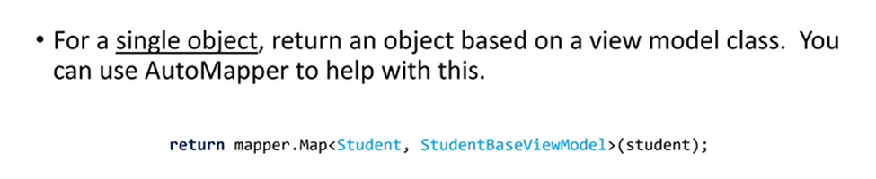

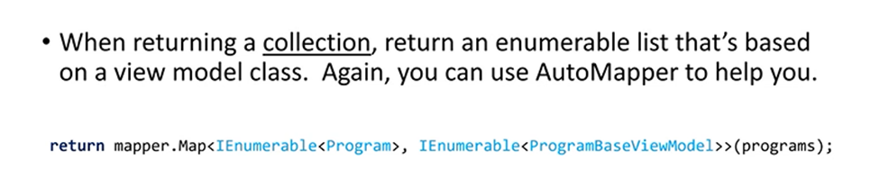

### Excution of the Linq Query - deferred execution

The fact that query did not get executed right away is called deferred execution.

When we write a Linq query, that query is not actually executed right away.  It might be executed next line, or never.

Queries normally got executed when the fetch/query result is used, or when the variable is needed for the auto mapper.

This is because of the performance concerns in case the query is not needed.

#### Linq example

Standard way:

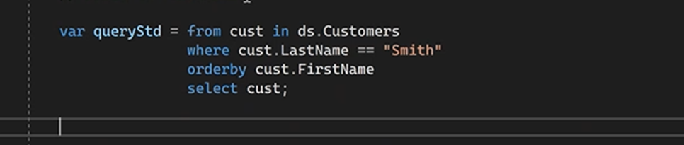

Fluent:

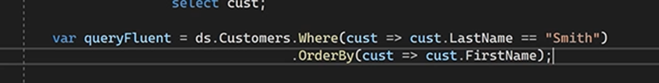

IQueryable is an interface that Linq query’s return type:

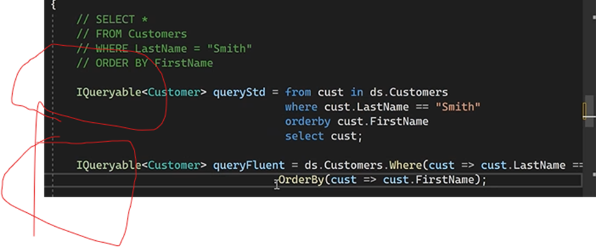

Every time you try to change from IQueryable to Actual objects. The Query will be executed.

Now imagine if there is no deferred execution:

The query will be executed multiple times and the results were not even used.

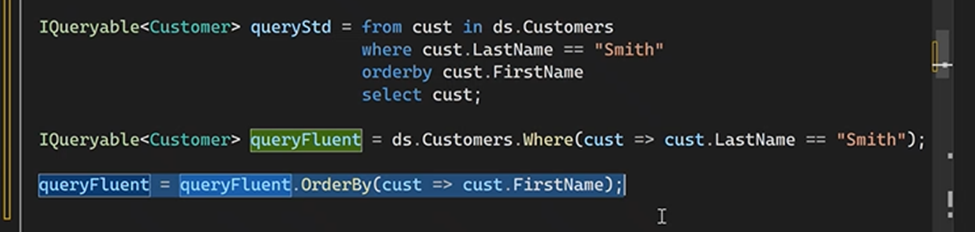

Now with the deferred execution, it will be like this: Only queryFluent will be executed because of the auto-mapper

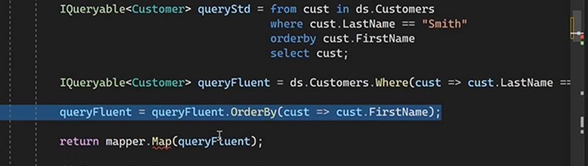

Or ToArray will cause the query executed:

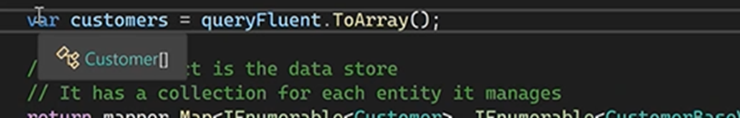

### More about OrderBy()

Normal allows you write it like SQL:

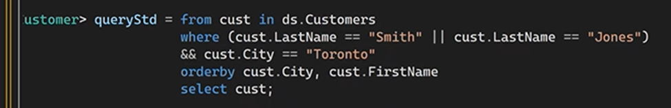

This is not ORDER BY CITY,FIRSTNAME. It will first sort by city, then sort by FirstName again.

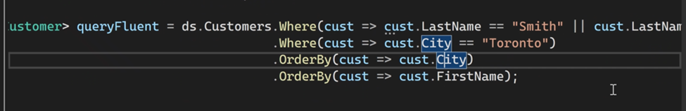

This is the solution, you have to use ThenBy

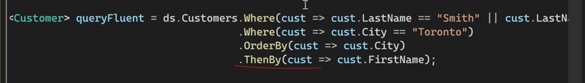

Desc Aesc

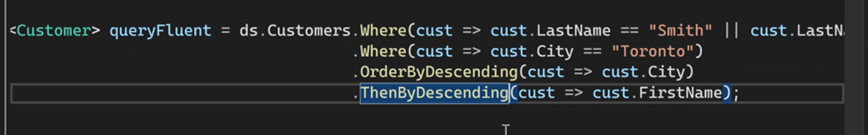

SORTING ALWAYS GOES AFTER FILTERING.

Because sorting is time and resource consuming. Very expensive.

Always filtering first then sort.

## Common mistakes of Linq

What are you doing? You could not do everything at DB with the power of Index.

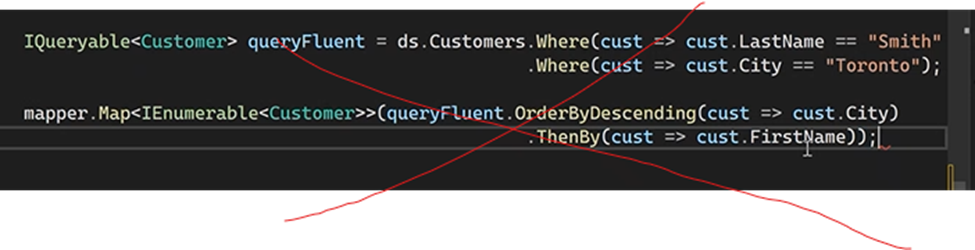

Same problem here.

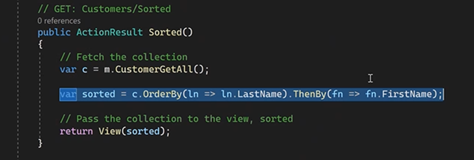

If you can use find, use find:

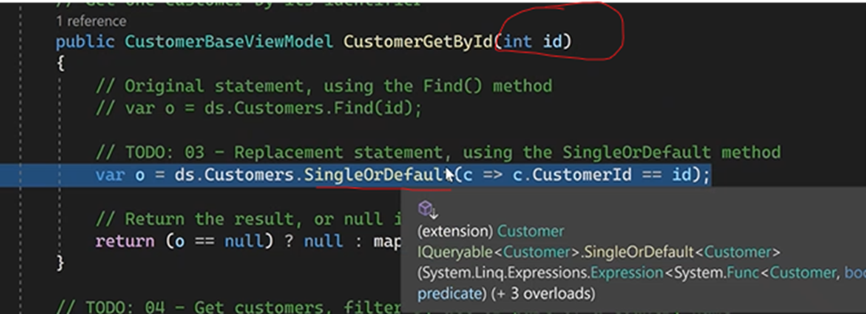

We always should finish everything on the Query before let it execute. Build a query then put it into the trigger keywords. 

## Debug notes

How to find out the view model invalid field?

errors normally inside teh last element of the array.

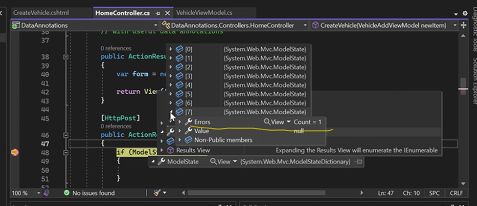

This will let you take a look at what’s inside the viewModel object.

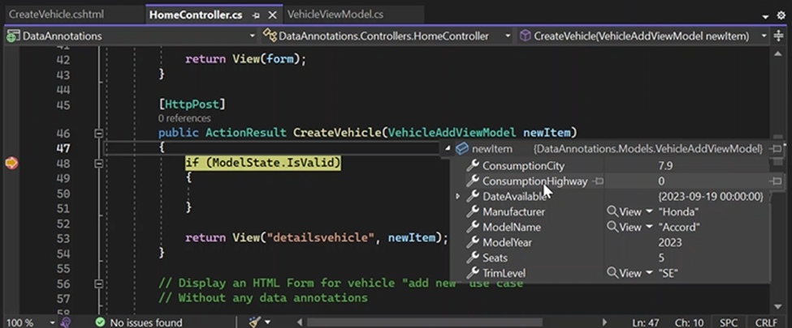

People can be array or table.  You can use projection in like select person.LastName

Never ever forget to use select “localRangeVariableName”; to end the query.

## Comment Tokens

This will be converted to task list.

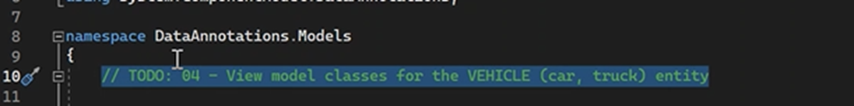

View-> Task list.

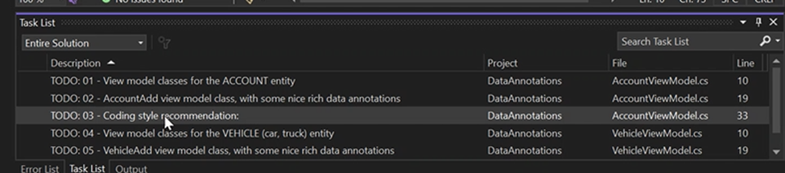
