# Security and ASP.NET Identity

## ASP.Net Identity

The applications built by using ASP.NET mvc is using security system -> ASP.NET Identity.

This product includes identity management such as authentication, authorization, and identity management (user account creation and maintenance)

At the same time, "identity use OAuth2 and OpenID Connect" and more standards."

### Terminologies in Identity

1. User Account:
An object that represents a human user of a web application. 
Includes identification properties such as a username and a shared secret. 
Includes descriptive property such as email address, first, last name. 
2. Authentication(AuthN)
The process of presenting and validating credentials.  Users enter the username and password into the frontend, and then the backend check the hashed value with the database. Then allows the user to login in if matched.
A web application that is configured to use ASP.NET identity includes the components needed for authentication, including a login page. 
3. Security principal (created after AuthN)
After authentication, the ASP.NET identity system creates a security principal object and attaches it to the execution context. 
Security principle will NOT STORE PASSWORD in the object. 
Among other data, this object includes claims (descriptive pieces of information about the user)
The web app returns an authentication cookie in the response to the browser. The browser will include the cookie in every subsequent request to the web app. (This is how the session works)
Without that cookie, you won’t be able to keep yourself logs in even after you choose to remember me.
4. Authorization (AuthZ)
After a user authenticates successfully, user’s claims determine whether they are authorized to perform tasks and access resource in the web app.  (user’s claim decides what to use)
Gives the right users with right access to the right features.

### Some advice from the 10 years .net MVC veteran

Do not write your own security infrastructure for web apps.

Use legitimate third party so the company will take liability for fixing it.

Why? Because it is you against the hacker community or the security company /community against the hacker community. You as a coder will never want to take all the legal responsibility.

### Hands on Demo

Create a new project:

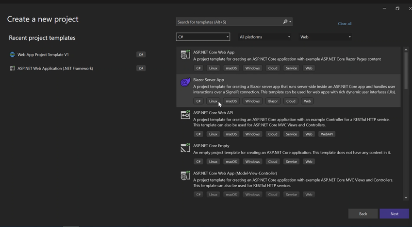

Choose this one:

Configure the empty project:

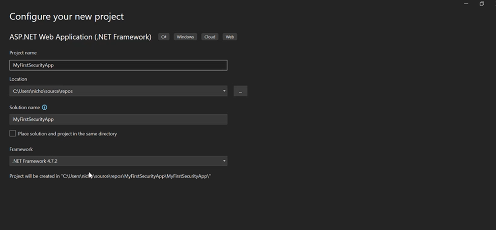

Choose the name and click next, choose the create a new ASP.NET web application:

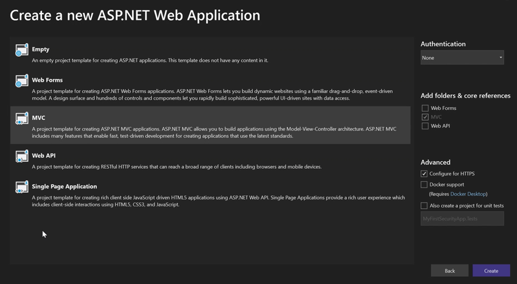

1.Choose MVC
2.Authentication

-> Individual Accounts (signing in by credentials or third party logging)
-> MS Identity platform (this is for user using MS365)
-> Windows (this is for using MS authentication)

3.Create project

Then you got a perfect project to run including register and log in. Everything just build when you create the project.

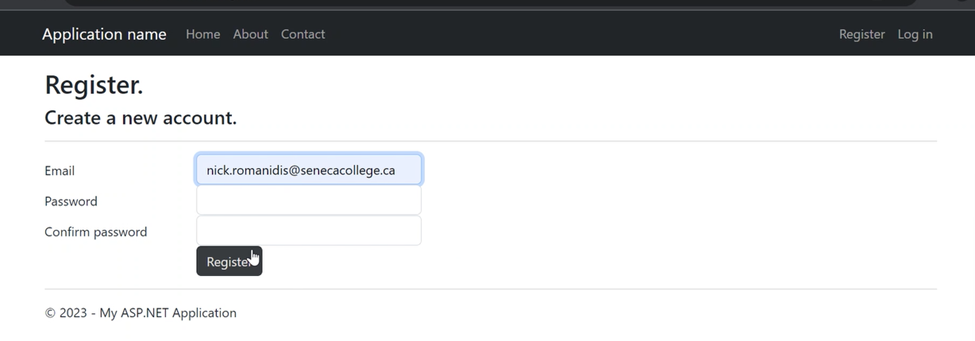

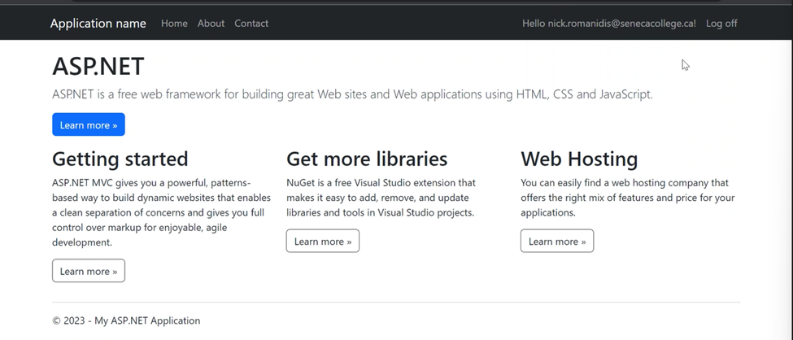

Registered and signed in already. Authentication is ready. So smooth. This is why I love MS development kits. Everything is built for you.

### A full walk through of using ASP.NET identity

1. Nugget manager these packages are installed because you used MS ASP.Net Identity

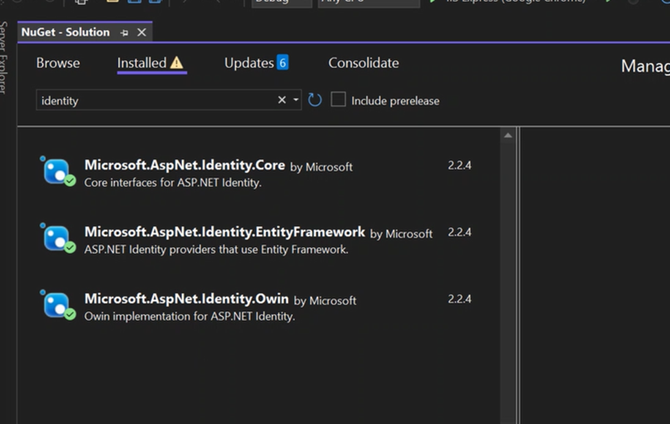

2. wire up the package in the startup.cs

Startup.cs => The app start point: (This is like the root of the project)

When the application first started, configureAuth() will be invoked.

Inside the configureAuth:

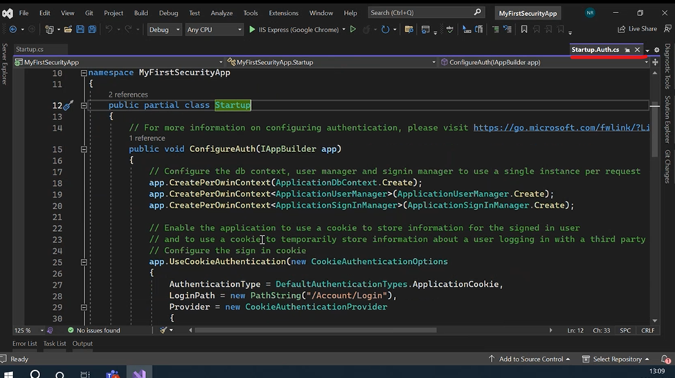

UserManager is made for managing the user accounts.

Signing Manager is made for managing signing methods.

All the methods here are made for setting up the configurations.

You could use 2 step authentication:

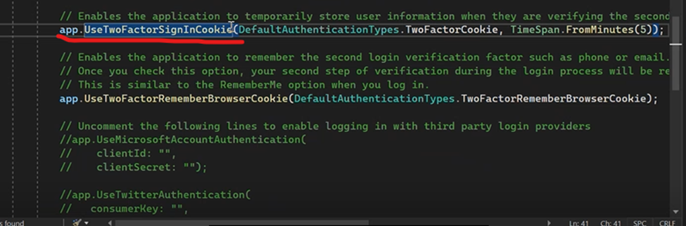

If you want to authenticate by other platforms:

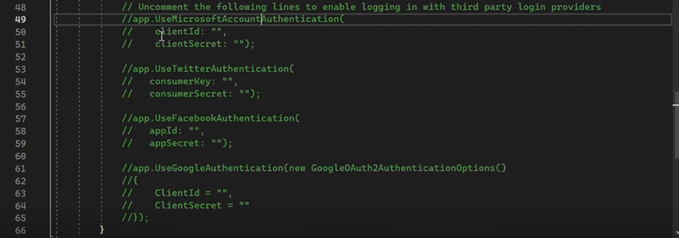

3. Other files inside the App_Start

If you want to set up 2 step auth, here to plug in the codes from the service providers.

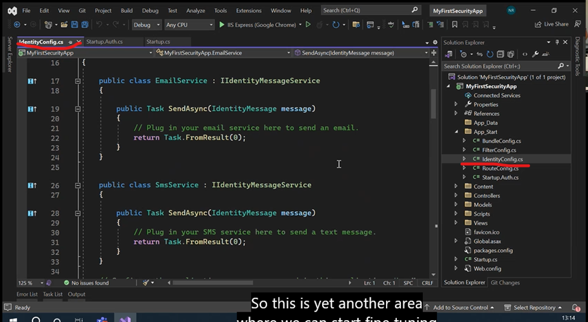

And this is the way dependency injection ish in dot net mvc.

Moreover, you have lock out and other more detailed authentication logics can be implemented here.

4. Store and access the user account information

"Model" is actually where all the design models and the view models go by default.

But we have been using the “data” as the folder to store the model files. (because core likes this way)

Don’t be surprised if mvc does this to the project.

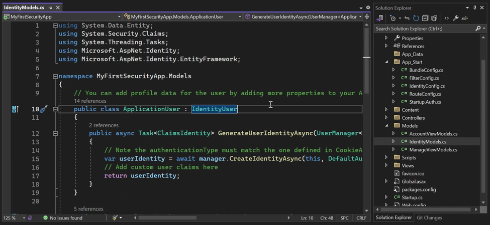

Remember you can add whatever properties you want at here. So, you add more properties into the design model. Ease of use and flexibility combined. ( but don’t even think of going to IdentityUser to add more fields. Why would you bother to add more fields inside the system library?)

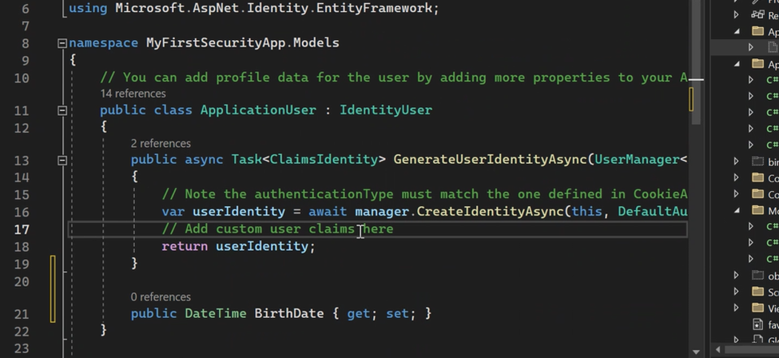

5. More new controllers and view models are added to the repo by using asp.net identity:

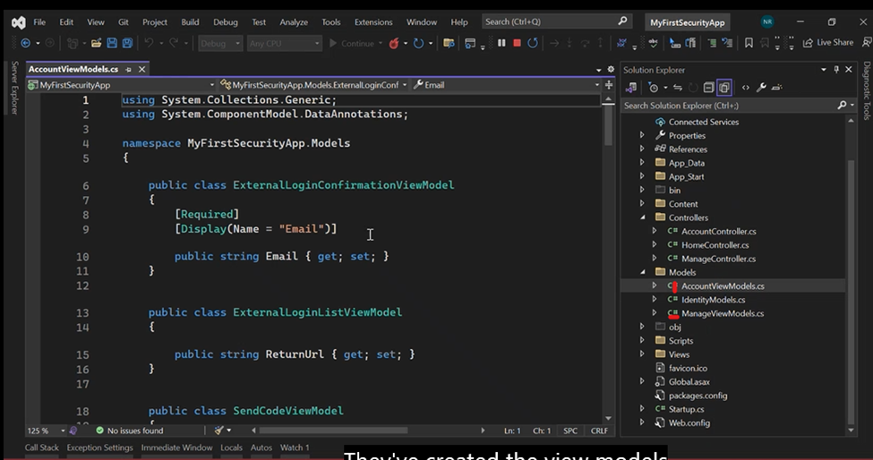

6. You can modify the login and register if you want to

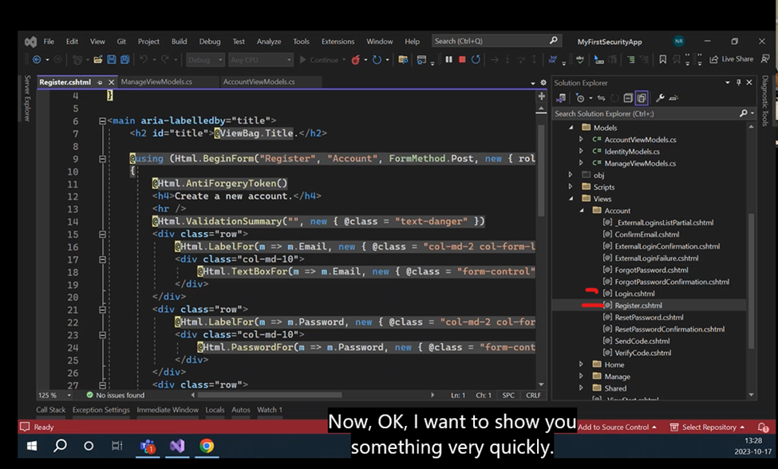

7. The class diagram

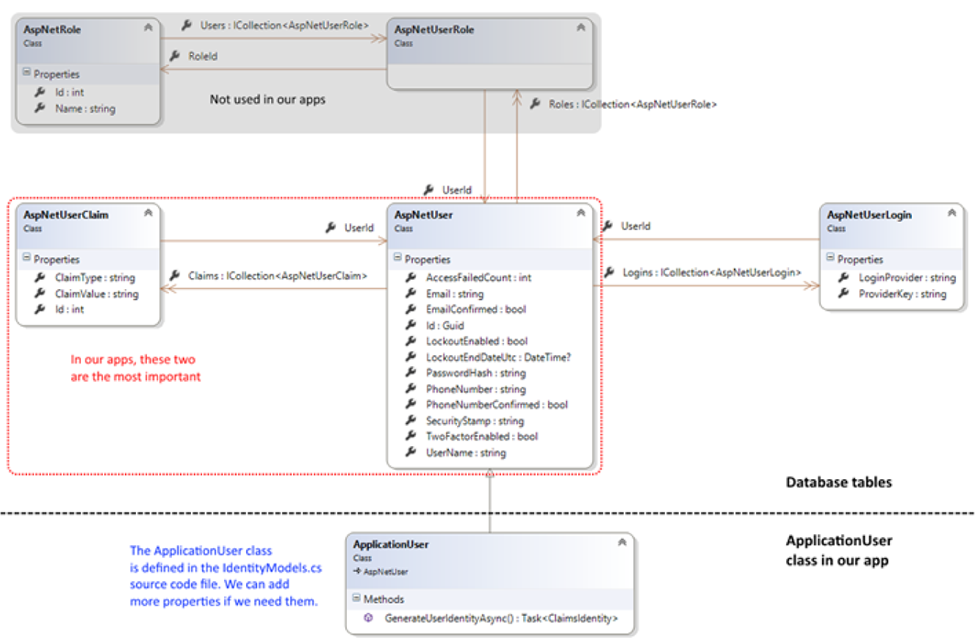

8. Role VS Claim:

Role:

Use claims are more flexible than using role. This will be introduced after next part. The reason is simple because features might not align well with the roles of your company structure. You want to have something more flexible.

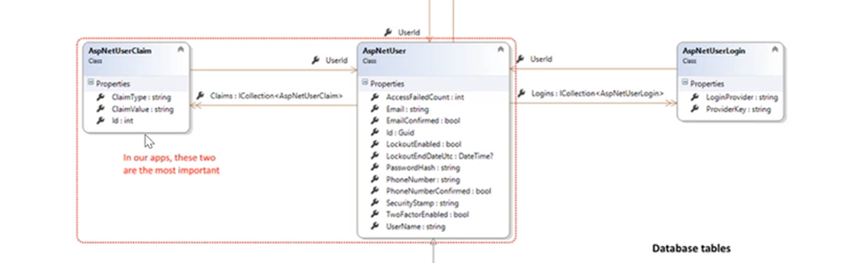

Claims:

Generally, there are two ways to add extra fields into the user structure.

Claim or AspNetUser

AspNetUserLogin-> If you want to have 3rd party login.

9. The buttons on the top bar

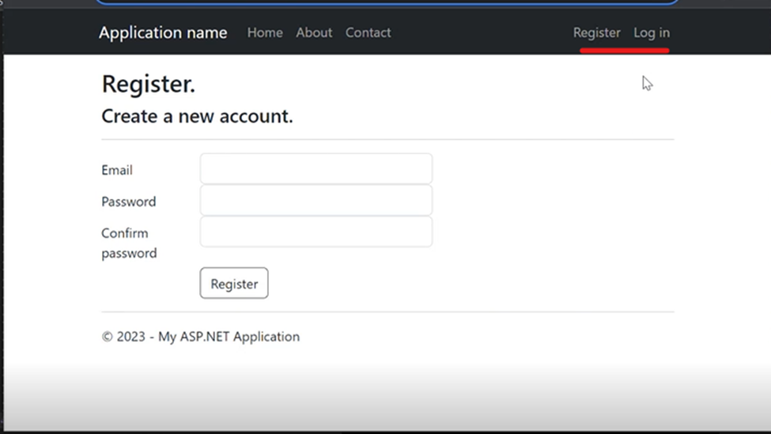

Shared-> layout-> In .net mvc, you could use partial template to be rendered in another template.

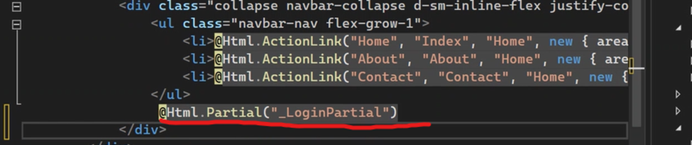

Firstly, you need to check if the user is authenticated (logged in) Further customization will be found in W9.

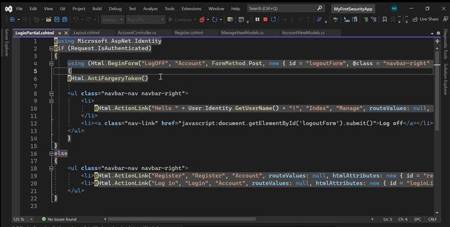

And you could have the conditional rendering like this -> allows user to log in.

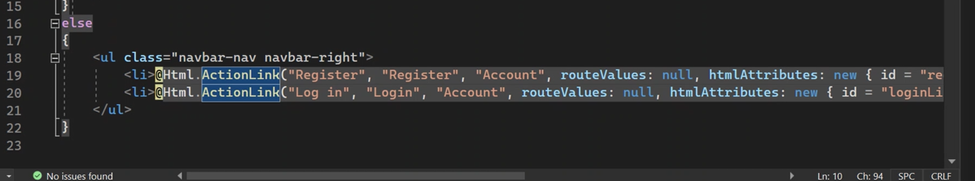

## Authentication flow in action

1. Cookies inside the authentication:

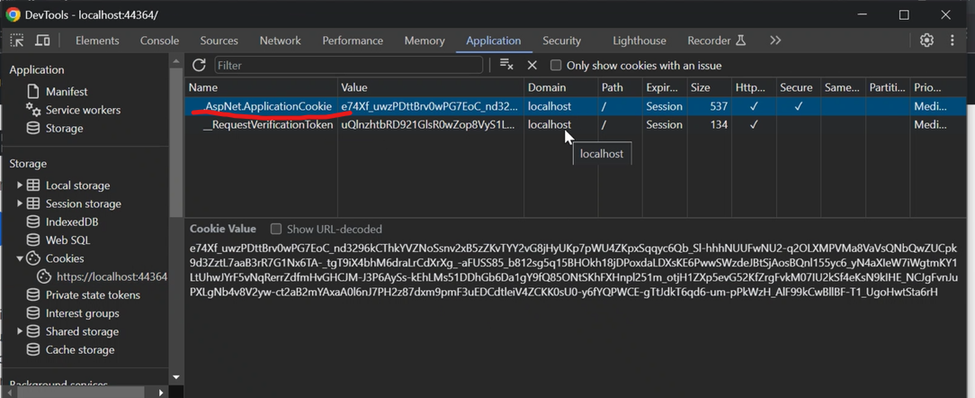

They stay inside the browser and it is hashed. Only the server knows how to decrypt it because of the private key.

The first one is called security principal -> keeps your session you won’t need to log in again and again.

The second one is called token -> This is used when you are submitting the form, the server knows it is you not the others submitted the form.

And We could configure to make the expiry length longer.

2. Authorization: What can you and can not do in this application?

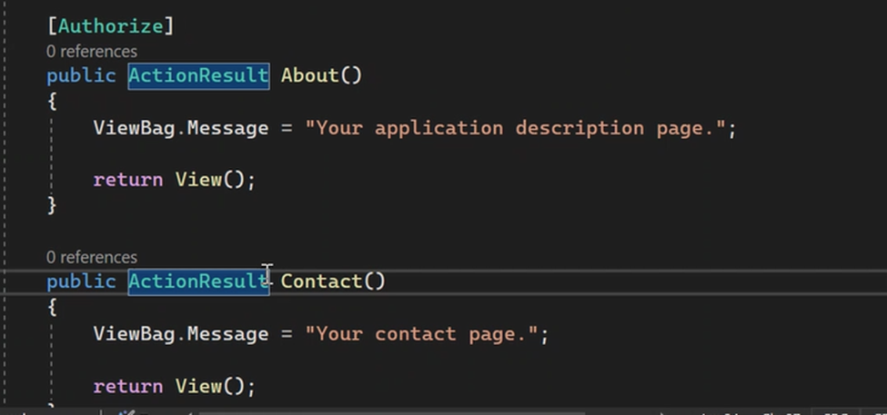

This is so much better than node.js because of the simplicity.

But what if you have 100 routes and you want them to be protected?

**So, you just put the Authorize above the controller, then all the routes from that controller is protected.**

\[AllowAnnoymous\] would allow people to access the route without logging -> meaning every route except this route I do not want to protect it.

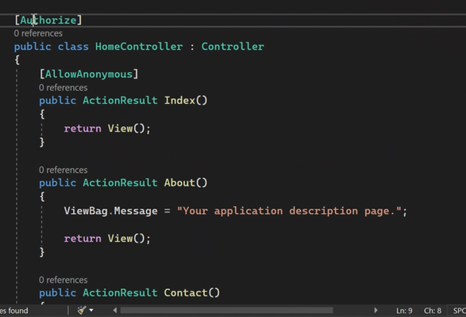

What if you have different levels of the users?

You could have roles inside the Authorize( But this is normally not recommended because of the flexibility) **According to the dot net veteran, claim is working better.**

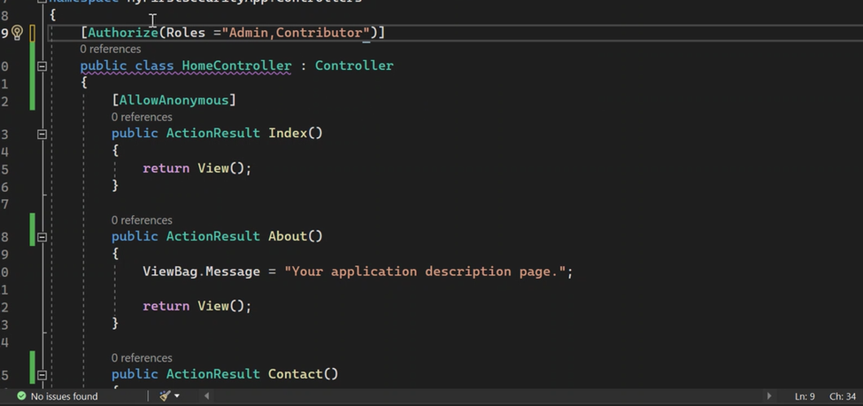

## A detail intro about Claim

### intro

A claim is a statement that one subject makes about itself or another subject.

A statement is a piece of descriptive information about a subject.

A subject is a participant of an application.

A Subject could be a user or corporate body or a programmable object.

So, what is claim => A claim is just something about someone says about someone or someone else.

WHAT THE HELL? Don’t overthink it, claim is just a piece of information belongs to something.

A claim statement in the format of  
  Claim type = Value

The claim type is a string. There is a list of standards, predefined, or “well known” claim types, which are URIs

A claim can have name, date of birth, role, surname. You could have customized claims.

### Claim management and issuance

While a claim is a statement about a subject, claims are managed and issued by an identity authority. (ASP.Net identity system in our web app)

A claim can be used by an application to authorize a user to access resources and perform tasks. (instead of using the roles in the system)

Claim are packaged inside the authentication cookie (not the _request verification cookie).

The result of a successful authentication is a cookie that (among other data) includes claims.

Our web app must trust the identity of authority:

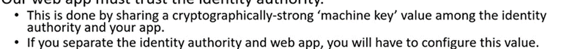

The machine key is here just in case you are curious.

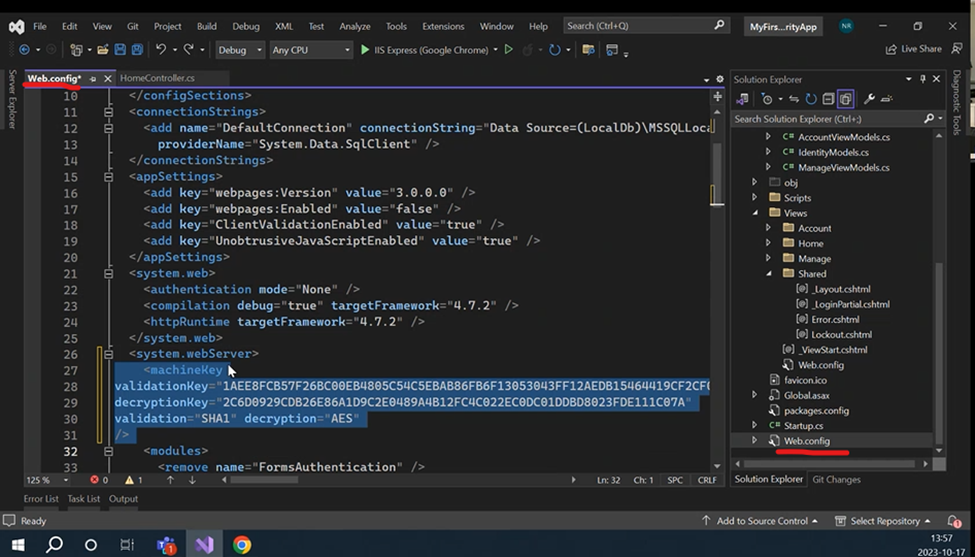

And no one can temper with the cookie otherwise the session will be forced to stopped and you will have to be AuthN again.